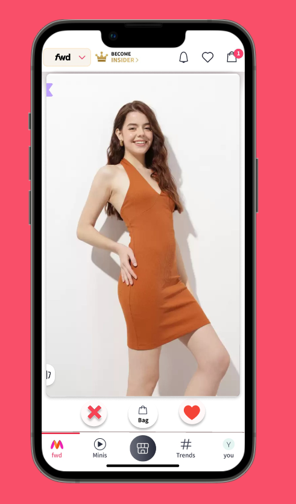
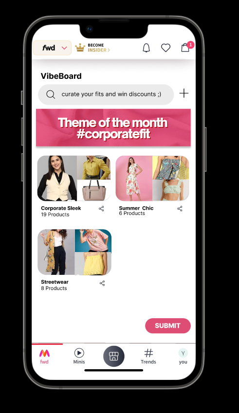

# Myntra HackerRamp: Team Pixel 

## Overview
Standing out requires innovation that captures and sustains user engagement. To address this, we propose integrating two cutting-edge features into the shopping platform: the Swiping Interface and VibeBoard. 

### Features

#### Swiping Interface
Inspired by popular dating apps like Tinder, our Swiping Interface offers a fun and intuitive way to shop for fashion. Users can swipe right on items they love and left on those they don't. This interaction helps our AI learn each user's unique style preferences, enhancing the accuracy of personalized fashion feeds with each swipe. The more you swipe, the better tailored your fashion recommendations become!

    

 

#### VibeBoard
Drawing inspiration from Pinterest, the VibeBoard allows users to search and express their fashion preferences creatively, akin to crafting a vision board. Users can search for outfits by typing in the desired vibe, such as "boho summer" or "streetwear vibes." Our AI-driven search algorithm then recommends items that match the described aesthetic. Users can save these looks to their VibeBoard for inspiration or add them directly to their cart, effectively bridging the gap between visualizing and owning a style.

    

 

VibeBoards are not only personal collections but also dynamic, shareable entities. Users can share their boards on social media, enhancing interaction and engagement. This feature serves as a powerful tool for influencers and helps predict upcoming fashion trends through aggregated data analysis.

## Team Members
- [Anoushka Sen](https://github.com/senanoushka)
- [Arunima Patra](https://github.com/arunima-patra)
- [Aveepsa Sarkar](https://github.com/LostCatinLostCity)

## Acknowledgments
- Myntra HackerRamp for the opportunity to innovate in fashion tech.
